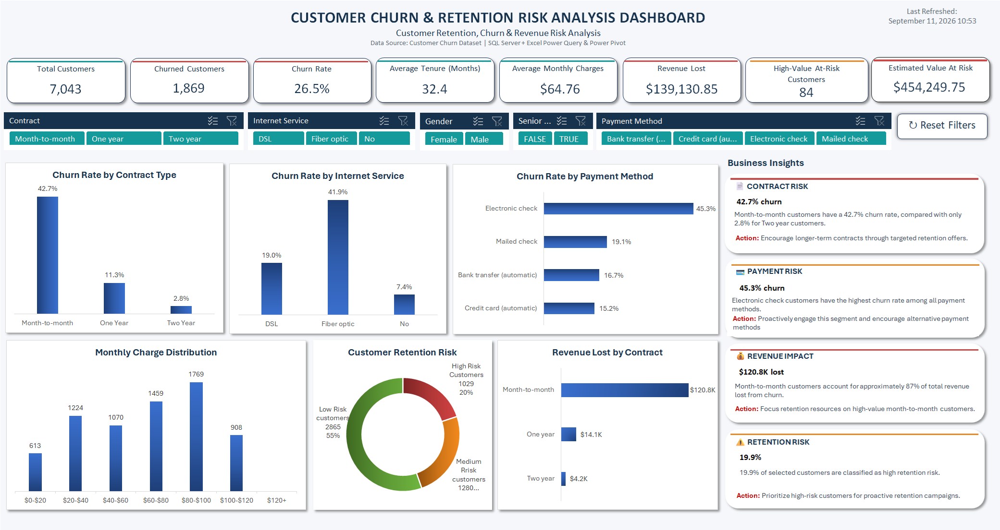

# Customer Churn & Retention Risk Analysis

## 📊 Project Overview

This project analyzes customer churn, retention risk, and revenue impact using **SQL Server and Microsoft Excel**.

The goal was to transform raw customer data into an interactive analytical solution that identifies key churn drivers, high-risk customer segments, and potential revenue at risk.

**Workflow:** SQL Server → SQL Analysis → Power Query → Power Pivot → Excel Dashboard → Business Insights

---

## 🎯 Business Objective

The analysis was designed to answer:

- How many customers have churned?
- What is the overall churn rate?
- Which contract types have the highest churn?
- Which internet service and payment methods are associated with higher churn?
- How does customer tenure relate to churn?
- Which customers have elevated retention risk?
- How much revenue has been lost due to churn?
- Which high-value customers should be prioritized for retention?

---

## 🛠️ Tools & Technologies

- SQL Server
- SQL
- Microsoft Excel
- Power Query
- Power Pivot
- PivotTables & PivotCharts
- Excel Slicers
- Excel Dashboarding

---

## 🔄 Project Workflow

### 1. Data Preparation & SQL Analysis

Customer data was loaded into SQL Server and analyzed using SQL.

SQL views were created for:

- Customer churn analysis
- Churn by contract
- Churn by tenure
- Customer retention risk
- High-value customers with elevated retention risk

### 2. Customer Risk Analysis

A customer risk scoring approach was developed using:

- Month-to-month contract
- Short customer tenure
- Higher monthly charges
- Lack of online security
- Lack of technical support

Customers were categorized into retention-risk groups.

### 3. Excel Data Model

SQL analysis results were connected to Excel using **Power Query** and incorporated into a **Power Pivot** data model.

The model enables dynamic dashboard filtering through slicers while maintaining a reusable analytical structure.

### 4. Interactive Dashboard

The final dashboard includes:

- **8 KPI cards**
- **6 charts**
- **5 slicers**
- Dynamic filtering
- Reset Filters functionality
- Last Refreshed timestamp
- Business insights

The dashboard analyzes:

- Churn rate by contract
- Churn rate by internet service
- Churn rate by payment method
- Monthly charge distribution
- Customer retention risk
- Revenue lost by contract

---

## 📈 Key Findings

Using the full customer dataset:

- **7,043 customers** were analyzed.
- Overall churn rate was **26.54%**.
- Average customer tenure was approximately **32.37 months**.
- Revenue lost from churn was approximately **$139,131**.
- **84 high-value customers** were identified as having elevated retention risk.
- The estimated value associated with these high-value at-risk customers was approximately **$454,250**.
- Month-to-month customers had substantially higher churn than customers on longer-term contracts.
- Electronic-check customers had the highest churn rate among the payment methods analyzed.

---

## 💡 Business Insights

### 1. Month-to-Month Customers

Month-to-month customers represent a particularly important churn-risk segment and may benefit from incentives to move to longer-term contracts.

### 2. High-Value At-Risk Customers

High-value customers with elevated retention risk should receive priority because losing these customers can have a larger financial impact.

### 3. Electronic-Check Customers

Electronic-check customers show significantly higher churn and may warrant further investigation into payment experience, customer behavior, or related service factors.

### 4. Early-Tenure Customers

Customers with combinations of short tenure, higher monthly charges, and limited support/security services may require proactive retention strategies.

---

## 📊 Dashboard

---

## 🔍 Project Validation

The Excel dashboard results were validated against the corresponding **SQL Server calculations** to ensure that KPIs and analytical results were accurate.

Slicer interactions and dashboard behavior were also tested to ensure the interactive reporting experience worked correctly.

---

## 🚀 Skills Demonstrated

- SQL querying and analytical views
- Data transformation
- Relational data analysis
- Customer segmentation
- Risk scoring
- KPI development
- Excel data modeling
- Power Query
- Power Pivot
- PivotTables and PivotCharts
- Interactive dashboard design
- Business intelligence reporting
- Translating data into business recommendations
